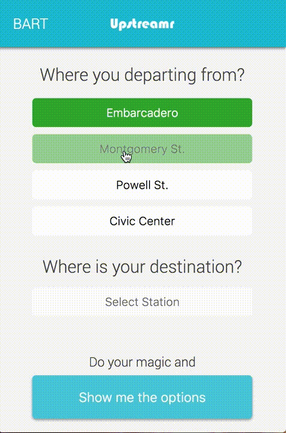

# Upstreamr

Commuting on BART during peak hours? Tired of never getting a seat and losing what could otherwise be productive time?

Try Upstreamr! It can help you find a seat by traveling 'upstream' to Civic Center or 16th street, stepping across the platform and getting a seat before the huddled masses crowd aboard- all without adding time to your commute!

Get [Upstreamr]. Get a seat, and be more productive! An hour per day standing on your commute home adds up to 260 hours (or 1.5 months of full-time work!) of discomfort to your life per year. Imagine if you could spend that time comfortably seated instead.




### Useful links

* [Trello board]
* [BART API]

### Hackathon group:

* [Igor]
* [Dallas]
* [Dan]
* [Maria]

### Project Management Workflow
[Link to our Trello board]

###### Base columns and workflow: ######
**TODO** --> **IN PROGRESS** --> **DONE**

###### Typical extended workflow: ######

1. _Choose a card_ from **TODO** assigned to you or unassigned.
2. _Move card_ to **IN PROGRESS** (assign to yourself) and start working on it.
3. If there is a problem or question to discuss that stopped u _move card_ to **STOPPED** and write a comment inside the card. We will discuss it on next meeting or over slack. Start working on next card.
4. If everything ok and u are done with card --->  _move card_ to **QA** (quality assurance/testing). Start working on next card.
5. _One of other team members_ do code review for the task in **QA** and check if everything work in a proper way.
6. If there is a bug he moves the card to **BUGS** with a detailed comment.
7. If everything OK he moves the card to **DONE**. And create a pull request.

### Github Workflow

Commits messages should be descriptive. Start your message with a verb: `Add` `Fix` `Change` `Refactor` `Remove` and follow with short but descriptive message what you have done.


###### General branches: ######
* **Master** for production ready code, that will be deployed to server (heroku prob)
* **Develop** for all our development code

All your work commits should be under **develop** branch. (exceptions for hot-fixes)

1. We should make **new feature-branch** for each **new general feature**.
2. On this **feature-branch** we will **create card-branches** for each trello card associated with this feature. ( It's optional. If card feature is small - no needed for separate sub-branch).
3. When **card is done** we merge _card-branch_ to _feature-branch_.
4. When **all cars/tasks for _feature-branch_ done** - we merge _feature-branch_ to _develop-branch_. And create a pull request to **develop** branch.

[Link to our Trello board]: <https://trello.com/b/PIuC5QsF/upstreamr>
[Trello board]: <https://trello.com/b/PIuC5QsF/upstreamr>
[Igor]: <https://github.com/IgorDmitriev>
[Dallas]: <https://github.com/dallaswmorgan>
[Dan]: <https://github.com/dankim93>
[Maria]: <https://github.com/mbelgrader>
[MarkDown preview online]: <http://markdownlivepreview.com/>
[BART API]: <http://api.bart.gov/docs/etd/etd.aspx>
[Upstreamr]: <https://upstreamr.herokuapp.com/>


### Detailed Project description ###

> Detailed Project description

#### Mockups ####

> Mockups

#### App Architecture ####

> App Architecture

#### Front-End <> Back-End ####

> Front-End <> Back-End

#### JSON Response ####

* Very unlikely
* Unlikely
* Likely
* Very likely

JSON Hash:
```
{
  start: 'embr',
  destination: 'rock',
  options: {
    fastest: {
      transfer: '',
      currentDeparture: '17:48',
      finalEta: 18:01,
      waitTime: 4,
      upsteamColor: '',
      upsteamDestination: '',
      downstreamColor: 'yellow',
      downstreamDestination: 'ptsb',
      transferArrival: '',
      transferDeparture: '',
      chanceOfStand: 'Very likely',
      chanceOfSeat: 'Likely'
    },

    optimal: {
      transfer: 'civic',
      currentDeparture: '17:26',
      currentWaitTime: 4,
      finalEta: 18:05,
      upsteamColor: 'red',
      upsteamDestination: 'mlbr',
      transferArrival: '17:30',
      transferDeparture: '17:42',
      transferWaitTime: 5,
      downstreamColor: 'yellow',
      downstreamDestination: 'ptsb',
      chanceOfStand: 'Very likely',
      chanceOfSeat: 'Likely'
    },

    guaranteedSeat: {
      transfer: 'UN Plaza',
      currentDeparture: '17:30',
      currentWaitTime: 4,
      finalEta: 18:11,
      upsteamColor: 'red',
      upsteamDestination: 'mlbr',
      transferArrival: '17:35',
      transferDeparture: '17:52',
      transferWaitTime: 5,
      downstreamColor: 'yellow',
      downstreamDestination: 'ptsb',
      chanceOfStand: 'Very likely',
      chanceOfSeat: 'Likely'
    }
  }
}
```

#### React Components ####

> React Components
